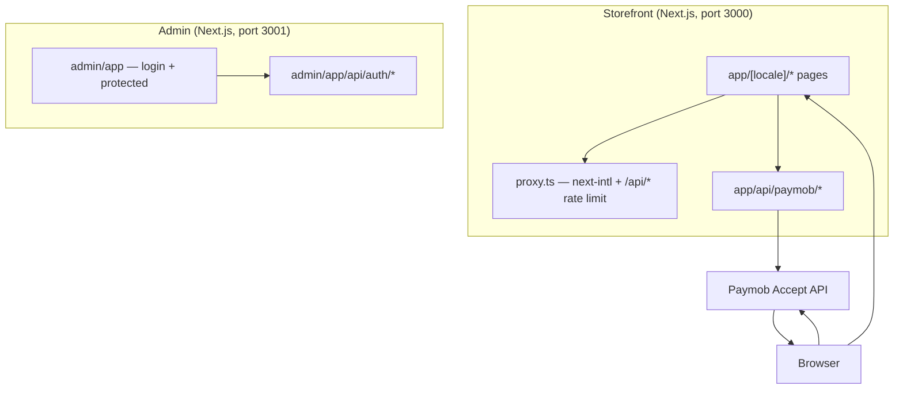

# Auréalis — architecture

**Last updated:** 2026-04-24 — update this date when you change routing, payment flow, admin auth, or deployment layout.

**UX / motion** — `app/globals.css` defines `--ease-luxury` and long hover durations. `components/LuxuryReveal.tsx` provides scroll-in reveals (intersection, once) with optional stagger. Home uses `mesh-hero--ambient`, bento `bento-sheen-layer`, and `app/[locale]/template.tsx` applies a very soft page shell on navigations. `prefers-reduced-motion: reduce` narrows or disables most motion.

**Branding (logo & locale)** — `components/BrandWordmark.tsx` accepts `src` and `blend`. The **home hero** and **navbar** use transparent **`logo-black.png`** with **`blend="none"`** and (on the hero) a warm **CSS `filter`** so the wordmark matches apricot/brand without a multiply white “panel” on the mesh. The **footer** also uses the black lockup. The **language switch** (EN / عربي) in `components/Navbar.tsx` links to the sibling locale. Adjust `BrandWordmark` `width` / `height` and `boxClassName` in the hero, navbar, and (if re-used) any other call site when re-tuning layout.

**Security** — See [SECURITY.md](./SECURITY.md). Summary: `proxy.ts` (Next.js 16 “proxy” convention) rate-limits `/api/*`, Paymob `init` uses Zod + body size limits + sanitization, `next.config` sets CSP/COOP/CORP/HSTS (when enabled), no raw SQL, Supabase is lazy-initialized. DDoS and global abuse require WAF/edge; in-memory rate limits are per process.

This document describes how the repository is structured and how major pieces interact. Pair it with `.env.example` for environment variables.

---

## High-level layout

- **Storefront** — public e-commerce UI, internationalized routes, **cart** and **wishlist** (Zustand + `localStorage`), **orders** and **track-order** client persistence (no server account), optional **Paymob** card checkout via server-only API routes, plus **sitemap/robots** and locale **not-found** / **error** boundaries.
- **Admin** — separate Next.js app under `admin/` (own `package.json`, **port 3001** in dev). Not the public site; intended for VPN / IP allowlist in production.

---

## Storefront (repository root)

| Area | Role |
|------|------|
| `app/[locale]/` | All localized **shop and content** routes; includes `not-found.tsx` and `error.tsx` for the locale segment. |
| `app/sitemap.ts` | Sitemap: static path segments × `en` / `ar`, plus `/product/[slug]` for each `lib/data` product. |
| `app/robots.ts` | `robots.txt` with `allow: /` and sitemap URL; base from `NEXT_PUBLIC_SITE_URL` or a localhost default. |
| `app/page.tsx` | Root entry; delegates to locale routing as configured. |
| `proxy.ts` | `next-intl` locale + global `/api/*` rate limit; `matcher` excludes static assets. |
| `i18n/` | `routing.ts`, `request.ts` — locales `en` / `ar`, message loading. |
| `messages/` | `en.json`, `ar.json` — all user-facing copy. |
| `components/` | Shared UI: `Navbar`, `Footer`, `ProductCard`, `ContentPageLayout`, `NewsletterForm`, etc. |
| `lib/data.ts` | Product catalog (in-repo); **source of truth for prices** server-side. |
| `lib/store.ts` | Zustand **cart**; persisted as `aurealis-cart`. |
| `lib/wishlist-store.ts` | Zustand **wishlist**; persisted as `aurealis-wishlist`. |
| `lib/orders-persist.ts` | Client-only: `localStorage` order list (`aurealis-orders`); idempotent append by `ref`; helpers for list and track-order. |
| `lib/checkout-pending.ts` + `lib/checkout-pending.types.ts` | `sessionStorage` copy of a pending order so `checkout/success` can build a `StoredOrder` when the user returns. |
| `lib/supabase.ts` | Supabase client (for future data/auth). |
| `lib/validate-cart.ts` | Server-side recalculation of line totals (piasters) from `productId` + `quantity` only. |
| `lib/paymob/*` | **Server-only** (via `server-only`): config, Accept API sequence, HMAC redirect verification, request origin helper, in-memory rate limit. |
| `app/api/paymob/ready` | `GET` — whether card checkout is configured (no secrets). |
| `app/api/paymob/init` | `POST` — validates origin (unless relaxed), rate limits, validates cart, creates Paymob session, returns `iframeUrl`. |
| `app/api/paymob/return` | `GET` — post-payment browser redirect; verifies HMAC, redirects to `/{locale}/checkout/success` or back to checkout with error. |

**`app/[locale]/` route map (examples under `/{locale}/…`):** home `""`, `shop`, `product/[slug]`, `search`, `cart`, `checkout`, `checkout/success`; `account` (hub), `account/orders`, `account/orders/[ref]`, `account/settings`; `wishlist`, `track-order`; `about`, `contact`, `faq`, `shipping`, `returns`; `privacy`, `terms`, `cookies`, `accessibility`, `directory`.

**Payment rule:** never trust client-reported prices. The init route recomputes amounts from `lib/data`.

**Client order history (not a server of record):** completed checkouts (demo or after Paymob return) are saved only in the browser; clearing storage, another device, or future server-backed auth will not show the same data until you sync to a database.

---

## Admin app (`admin/`)

| Area | Role |
|------|------|
| `app/(protected)/` | Dashboard home at `/`; `layout.tsx` enforces **session cookie** + optional **IP allowlist** (`ADMIN_ALLOWED_IPS`). |
| `app/login/` | Password login; `layout.tsx` applies same IP gate. |
| `app/api/auth/login` | `POST` JSON `{ password }`; rate limited; sets HttpOnly session cookie. |
| `app/api/auth/logout` | `POST`; requires valid session; clears cookie. |
| `lib/session.ts` | **AES-256-GCM** session cookie (derived key via scrypt, `node:crypto`); optional legacy v1 HMAC read; `ADMIN_SESSION_SECRET` in production. |
| `lib/auth-password.ts` | `ADMIN_PASS_HASH` (bcrypt) or dev-only `ADMIN_DEV_PASSWORD`. |

**Why a second app?** Isolation: different port, no shared public routes, and you can block it at the firewall or reverse proxy. Do not expose admin URLs on the public internet without hardening (VPN, IP allowlist, strong secrets).

**Note:** There is no shared `proxy` / route guard for the admin app session in the storefront — admin protection is **server layouts** + API checks so `node:crypto` stays on the Node server runtime.

---

## Security measures (summary)

- Paymob **API key** and **HMAC secret** are server env only; never in `NEXT_PUBLIC_*`.
- Security headers in root `next.config.ts` and `admin/next.config.ts` (CSP is stricter on admin).
- `POST /api/paymob/init` checks **Origin** against `NEXT_PUBLIC_SITE_URL` / Vercel host (bypass for local dev or `PAYMOB_RELAX_ORIGIN=1` for tooling only).
- **HMAC** on Paymob return URL must be validated before treating payment as success; align field order with [Paymob’s current docs](https://developers.paymob.com) if the dashboard test callback differs.
- In-memory rate limit on init is **per Node instance**; use Redis/Upstash if you run multiple instances.

---

## Data flow — card checkout (happy path)

1. Client loads checkout; fetches `GET /api/paymob/ready`.
2. User submits address form; “Pay with card” calls `POST /api/paymob/init` with `locale` + line items (ids + quantities) + billing fields.
3. Server validates cart → Paymob order + payment key → `iframeUrl`.
4. Browser goes to Paymob hosted iframe; user pays.
5. Paymob redirects to `GET /api/paymob/return?...&hmac=...`.
6. Server verifies HMAC, then redirects to localized success or checkout with an error code.

Before redirecting to Paymob (or submitting a **demo** order), the client stores a **pending checkout** in `sessionStorage` (`lib/checkout-pending.ts`). The **success** page reads that payload (once), appends a **`StoredOrder`** to `localStorage` (`lib/orders-persist.ts`) when a matching `ref` is present, and links to `account/orders/[ref]`. This is for UX only until orders are ingested on the server.

**Fulfillment at scale:** consider a **server-to-server** Paymob “transaction processed” webhook to record paid orders; redirect HMAC alone may not be enough for dispute handling.

---

## TypeScript and tooling

- Root `tsconfig.json` **excludes** `admin` so the two apps do not type-check as one project.
- Admin has its own `tsconfig.json` and `node_modules` (run `npm install` in `admin/` once).

---

## Maintenance

- When adding routes, data sources, or third-party APIs, update **this file** and the **“Project structure”** section of `README.md`.
- When bumping **Next.js** or **next-intl**, re-check `proxy.ts` and `createNextIntlPlugin`—Next 16 uses the **proxy** file convention instead of `middleware.ts`.
